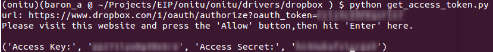
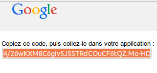
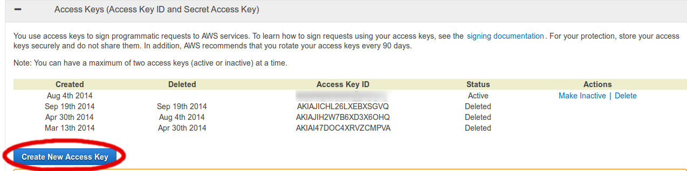
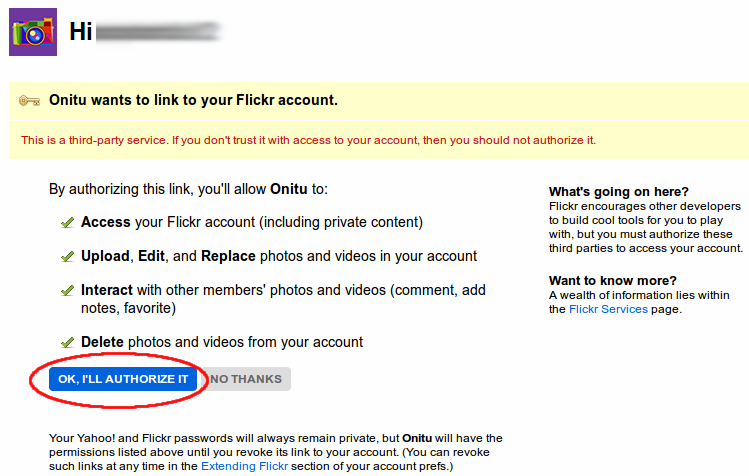
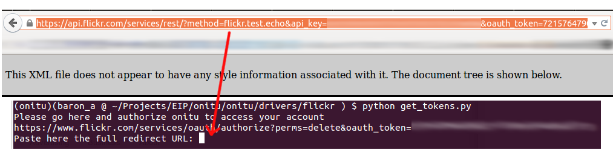
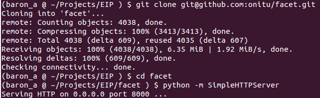

# Configuration

Une fois qu'Onitu et les *drivers* des services que vous désirez utiliser sont correctement installés avec PIP, il reste à configurer leur utilisation au sein du logiciel.

Pour ce faire, la configuration d'Onitu s'effectue par l'édition d'un fichier de configuration au format *YAML*.

Dans ce chapitre, nous allons aborder, point par point, tout ce qu'il y a à savoir pour configurer *Onitu* et ses services.

## Le nom

Premièrement, chaque configuration *YAML* possède un attribut `name` déterminant son nom.

Ce nom est utilisé en interne pour permettre de lancer simultanément plusieurs configurations différentes. Assurez-vous donc que ce nom soit unique.

## Les services

La section `services` du document *YAML* vous permet de lister les services.

Un service est une instance de *driver*, et correspond au paramétrage d'un compte sur ce service de stockage. Chaque service est associé à une clef permettant de l'identifier, dans les règles par exemple.

Un service est composé :

* d'un nom permettant de l'identifier de manière unique : "dropbox-bob", "dropbox-alice"...
* d'un champ `driver` contenant le nom du *driver* à instancier, en général le même que celui du service supporté par ce *driver*, comme *dropbox* ou *google_drive*
* d'un champ `options` pour les options de lancement de ce *driver*. Ces options sont spécifiques à chaque service, comme les données de connexion, et peuvent varier selon les *drivers*. Dans cette documentation, le symbole\Mandatory{} symbolise qu'il s'agit d'un champ obligatoire.

\newpage

### Fichiers locaux

Ce driver est inclus dans l'installation de base d'*Onitu*. Il permet de transférer et synchroniser des fichiers avec votre système de fichiers local, sur votre disque dur.

Le nom à utiliser pour le *driver* des fichiers locaux est `local_storage`. Ce *driver* ne comporte qu'une option :

* \Mandatory{root} : le répertoire racine à partir duquel il opère.

**Attention**: le nom du répertoire racine est relatif à celui dans lequel est contenu *Onitu*.

Une configuration possible est la suivante:

\begin{figure}[h]
\begin{lstlisting}[language=yaml,firstnumber=1]
Local:
  driver: local_storage
  root: example/local_driver
}
\end{lstlisting}
\end{figure}

\newpage

### Dropbox

Le nom du *driver* **Dropbox** est simplement `dropbox`. Il vous permet de connecter les fichiers de votre compte Dropbox à Onitu.

**Attention** : il existe un bogue connu concernant les fichiers dont le nom entraîne un "conflit de casse". Reportez-vous à la section **[Bogues connus]** à ce sujet.

Il comporte quatre options :

* \Mandatory{root} : le dossier à l'intérieur duquel Onitu placera tous vos fichiers sur Dropbox
* \Mandatory{access\_key} : votre clé d'accès Dropbox
* \Mandatory{access\_secret} : votre clé secrète Dropbox
* **changes_timer** : la fréquence à laquelle Onitu vérifie les changements sur le compte Dropbox, en secondes. **La valeur par défaut est 60 secondes.**

Pour obtenir vos clés d'accès, vous devrez vous servir du script d'authentification **get_access_token.py** fourni à l'installation du driver Dropbox. Vous devez au préalable être connecté-e sur Dropbox.

\newpage

Un exemple de configuration de service Dropbox réussie :

\begin{figure}[h]
\begin{lstlisting}[language=yaml,firstnumber=1]
dropbox-bob:
  driver: dropbox
  options:
    access_key: "MY_ACCESS_KEY"
    access_secret: "MY_SECRET_KEY"
\end{lstlisting}
\end{figure}

\newpage

### Google Drive

Le nom du *driver* Google Drive est `google_drive`. Il vous permet de connecter l'espace de stockage Drive de votre compte Google à Onitu.

Le service du *driver* Google Drive comporte cinq options :

* \Mandatory{root} : le dossier à l'intérieur duquel Onitu interagira avec Google Drive
* \Mandatory{refresh\_token} : le jeton d'autorisation pourra accéder à votre compte Drive *(voir plus bas)*
* \Mandatory{client\_id} : la clé d'identification de l'application pour l'API Google Drive
* \Mandatory{client\_secret} : la clé secrète de l'application pour l'API Google Drive
* **changes\_timer** : la fréquence à laquelle Onitu vérifie les changements sur le compte Drive, en secondes. **La valeur par défaut est de 60 secondes.**

Pour obtenir vos clés d'autorisation Google Drive pour Onitu, vous devez vous servir du script **grt.py** fourni à l'installation du *driver* Google Drive.

Lancez-le dans un terminal, puis accédez à l'URL qu'il génère dans votre navigateur Web.

\newpage

Copiez le code d'autorisation dans votre terminal. Le script génère alors un *refresh token*, un des codes à utiliser dans votre configuration d'Onitu.

Enfin, vous aurez besoin de récupérer le *Client ID* et le *Client Secret* de l'application Onitu. Pour ce faire, ouvrez le fichier **grt.py** dans un éditeur de texte, et récupérez la valeur des champs nommés *client_id* et *client_secret*.

\newpage

Un exemple de configuration du service Drive réussie :

\begin{figure}[h]
\begin{lstlisting}[language=yaml,firstnumber=1]
google-drive-celine:
  driver: google_drive
  options:
    root: "onitu/"
    refresh_token: "MY_REFRESH_TOKEN"
    client_id: "MY_CLIENT_ID"
    client_secret: "MY_CLIENT_SECRET"
    changes_timer: 300
\end{lstlisting}
\end{figure}

\newpage

### Amazon S3

Le nom du *driver* Amazon S3 est `amazon_s3`. Il vous permet de connecter un *bucket* Amazon S3 à Onitu.

**Attention**: Amazon S3 est un service **payant** au nombre de requêtes HTTP effectuées avec lui. L'utilisation d'Onitu ne déroge pas à cette règle, et c'est pourquoi **votre activité avec Amazon S3 au travers d'Onitu vous sera facturée par Amazon tout comme des transferts classiques**.

Le service du *driver* Amazon S3 comporte cinq options :

* \Mandatory{root} : le dossier à l'intérieur duquel Onitu placera tous vos fichiers sur Amazon S3
* \Mandatory{bucket} : le bucket Amazon S3 avec lequel Onitu doit se connecter
* \Mandatory{aws\_access\_key} : votre clé d'accès AWS
* \Mandatory{aws\_access\_secret} : votre clé secrète AWS
* **changes_timer** : la fréquence à laquelle Onitu vérifie les changements sur le bucket Amazon S3, en secondes. La valeur par défaut est **10 secondes**. **Cette action consomme 2 requêtes HTTP GET.**

Si vous ne possédez pas déjà vos clés d'accès Amazon S3, il faut vous connecter à votre compte Amazon et vous rendre à l'adresse \url{https://console.aws.amazon.com/iam/home?#security_credential}.

Pour créer une nouvelle paire de clés, cliquez sur "Create New Access Keys". L'opération devrait être instantanée et générer un ID de clé d'accès et une clé d'accès secrète. Ce sont les clés que vous devez utiliser avec Onitu.

\newpage

Un exemple de configuration du service Amazon S3 réussie :

\begin{figure}[h]
\begin{lstlisting}[language=json,firstnumber=1]
amazon-s3-alice:
  driver: amazon_s3
  options:
    root: "onitu/"
    bucket: "my-bucket"
    aws_access_key: "MY_ACCESS_KEY"
    aws_secret_key: "MY_SECRET_KEY"
    changes_timer : 300
\end{lstlisting}
\end{figure}

\newpage

### HubiC

Le nom du *driver* pour le service HubiC d'OVH est `hubic`. Il vous permet de connecter votre compte HubiC à Onitu.

Le service du *driver* HubiC comporte cinq options :

* \Mandatory{root} : le dossier à l'intérieur duquel Onitu placera tous vos fichiers sur Hubic
* \Mandatory{refresh\_token} : votre clé pour accéder à Hubic depuis Onitu *(voir plus bas)*
* \Mandatory{client\_id} : l'identifiant de votre application Onitu pour Hubic *(voir plus bas)*
* \Mandatory{client\_secret} : la clé secrète de votre application Onitu pour Hubic *(voir plus bas)*
* **changes_timer** : la fréquence à laquelle Onitu vérifie les changements sur le compte Hubic, en secondes. La valeur par défaut est **60 secondes**.

Pour utiliser Onitu avec HubiC, il vous faut créer une application Onitu pour HubiC.

Une fois votre compte HubiC créé, commencez par vous rendre sur la page <https://hubic.com/home/browser/developers/>. Pour créer une nouvelle application, cliquez sur "*Add an application*". Assurez-vous de choisir un nom unique pour votre application. Entrez `http://localhost/` comme domaine de redirection.

Une fois votre application HubiC créée, vous devez récupérer son identifiant et sa clé secrète. Pour cela, cliquez sur "Details" dans l'interface, et copiez le contenu des champs "*Client ID*" et "*Secret Client*".

\newpage

Ouvrez ensuite le script **get_refresh_token.py** fourni avec l'installation du *driver* HubiC dans un éditeur de texte, et remplacez le contenu de `client_id` et `client_secret` avec les clés que vous avez récupérées sur l'interface HubiC.

Vous devrez ensuite lancer le script à l'aide de la commande `python get_refresh_token.py`. Après avoir appuyé sur Entrée, le script ouvrira une fenêtre dans votre navigateur Internet où vous devrez rentrer vos identifiants HubiC et cliquer sur le bouton "Accept" pour autoriser Onitu à accéder à votre compte HubiC.

\newpage

Vous arriverez ensuite sur une page vide, car vous n'avez aucune application Web hébergée sur votre ordinateur permettant de récupérer le code de vérification. Mais vous pouvez le récupérer depuis la barre d'adresse de votre navigateur, en copiant la valeur du paramètre `code`.

\newpage

Retournez dans le terminal pour coller le code ainsi copié. Le script produira alors un code d'autorisation, le *refresh token*, qui est celui que vous devrez utiliser pour configurer Onitu.

\newpage

Un exemple de configuration du service HubiC réussie :

\begin{figure}[h]
\begin{lstlisting}[language=yaml,firstnumber=1]
hubic-jean-pierre:
  driver: hubic
  options:
    root: "onitu/"
    refresh_token: "MY_REFRESH_TOKEN"
    client_id: "MY_CLIENT_ID"
    client_secret: "MY_CLIENT_SECRET"
    changes_timer : 300
\end{lstlisting}
\end{figure}

\newpage

### Flickr

Le nom du *driver* pour Flickr est `flickr`. Il vous permet de connecter votre compte Flickr à Onitu, et de synchroniser vos photos gérées par Onitu avec Flickr.

**Attention** : le *driver* Flickr est dit "à sens unique". En effet, en raison de limitations techniques, il n'est pas possible d'importer des photos depuis Flickr avec Onitu. Il vous sera uniquement possible d'envoyer des photos sur Flickr depuis d'autres services gérés par Onitu, mais l'inverse n'est pas vrai.

Le service du *driver* Flickr comporte quatre options:

* \Mandatory{root} : le dossier à l'intérieur duquel Onitu placera tous vos fichiers sur Flickr
* \Mandatory{oauth\_token} : votre jeton d'accès OAuth pour Flickr *(voir plus bas)*
* \Mandatory{oauth\_token\_secret} : votre clé secrète OAuth pour Flickr *(voir plus bas)*
* **changes_timer** : la fréquence à laquelle Onitu vérifie les changements sur le compte Flickr, en secondes. La valeur par défaut est **20 secondes**.

Pour utiliser Onitu avec Flickr, il vous faut lancer dans un terminal le script **get_tokens.py** fourni à l'installation du *driver* Flickr pour Onitu.

Vous aurez besoin de vous rendre à l'adresse indiquée dans votre navigateur Web pour autoriser Onitu à accéder à votre compte Flickr. Flickr vous redirigera ensuite sur un document XML contenant vos informations d'autorisation, dont vous devrez copier-coller l'adresse dans votre terminal pour finaliser la procédure du script.

\newpage

La page Flickr vous redirige alors sur un document XML. Copiez la nouvelle URL de ce document, revenez dans votre terminal, et collez-la à l'emplacement prévu à cet effet par le script.

Le script vous procure alors les jetons OAuth que vous serez en mesure d'utiliser dans votre configuration Onitu.

\newpage

Un exemple de configuration du service Flickr réussie :

\begin{figure}[h]
\begin{lstlisting}[language=json,firstnumber=1]
flickr-william:
  driver: flickr
  options:
    root: "onitu/"
    oauth_token: "MY_OAUTH_TOKEN"
    oauth_secret_token: "MY_SECRET_TOKEN"
    changes_timer : 300
\end{lstlisting}
\end{figure}

\newpage

### Bilan des fonctionnalités des services

En raison de limitations techniques inhérentes à chaque service relié à Onitu, il est important de comprendre que chaque service n'apporte pas les mêmes fonctionnalités au sein d'Onitu, en fonction de ce que leur interface permet à une application tierce de réaliser (ici, Onitu). Parmi les principales interactions possibles entre Onitu et un service donné, nous pouvons lister :

- Transférer des fichiers provenant d'autres services connectés à Onitu vers ce service
- Transférer des fichiers provenant de ce service vers d'autres services connectés à Onitu
- Supprimer des fichiers synchronisés sur ce service si ils ont été supprimés sur un autre service connecté à Onitu
- Notifier la suppression de fichiers supprimés sur ce service aux autres services connectés à Onitu
- Notifier qu'un nouveau fichier sur ce service est en réalité le déplacement d'un ancien fichier

Voici un tableau récapitulatif permettant de mieux comprendre ce qu'il est possible de réaliser au sein d'Onitu, et avec quel service :

\begin{tabular}{|l|c|c|c|c|c|c|c|}
\hline
\rowcolor{onitu}
\rowstyle{ \color{lightGray} \bfseries}
Drivers & \textcolor{lightGray}{\textbf{Dropbox}} & \textcolor{lightGray}{\textbf{Google Drive}} & \textcolor{lightGray}{\textbf{Amazon S3}} & \textcolor{lightGray}{\textbf{HubiC}} & \textcolor{lightGray}{\textbf{Flickr}}\\
\hline
Transfert vers le service & \Oui & \Oui & \Oui & \Oui & \Oui\\
Transfert depuis le service & \Oui & \Oui & \Oui & \Oui & \Non\\
Suppression sur le service & \Oui & \Oui & \Oui & \Oui & \Non\\
Détection des suppressions & \Oui & \Oui & \Non & \Non & \Non\\
Détection des déplacements & \Non & \Non & \Non & \Non & \Non\\
\hline
\end{tabular}

## Les règles

Les règles vous permettent de définir quels fichiers doivent être synchronisés vers quels services. Les règles se definissent en deux parties, la première partie est la définition des dossiers (`folders`) et la deuxième est la définition des règles dans les differents services.

La définition des dossiers se place dans l'option `folders`, c'est une liste de noms de dossiers contenant les options de chacun d'eux.

Il faut donc nommer chaque dossier, vous pouvez ensuite ajouter des options à celui ci:

- L'option `type`:

Cette option permet de filtrer le type de fichiers qui seront synchronisés dans ce dossier. Cette option est une liste contenant la définition de ces types. Les définitions suivent la norme MIME (RFC 2045) et il est possible d'utiliser le sélecteur universel (`*`) afin de préciser seulement l'extension ou seulement le type de fichier. Exemple:

- audio/ (Tous les fichiers audio quelle que soit leur extension)
- */mpeg (Tous les fichiers ayant une extension mpeg quel que soit leur type)

- L'option `size`:

Cette option permet de filtrer la taille des fichiers qui seront synchronisés dans ce dossier. Cette option peut en contenir deux, à savoir `min` et `max` correspondant à la taille minimum ou maximum qu'un fichier doit faire pour etre synchronisé dans ce dossier. Vous pouvez préciser la taille des fichiers en utilisant les suffixes suivants:

- Octet: pas de suffixes, o, b
- Kilooctet: k, ko, kb
- Mégaoctet: m, mo, mb
- Gigaoctet: g, go, gb
- Téraoctet: t, to, tb
- Pétaoctet: p, po, pb

- Kibi: ki
- Mibi: mi
- Gibi: gi
- Tébi: ti
- Pébi: pi

Exemple:

    size:
       min: 2G

    size:
       min: 2ko
       max: 5t

- L'option `whitelist`:

Cette option permet de filtrer les fichiers qui seront acceptés dans le dossier. Si cette option est precisée, tous les fichiers sont refusés par defaut, ce qui la rend incompatible avec l'option `blacklist`. Cette option est une liste qui peut contenir des noms de fichiers, des noms de dossiers, ou des expressions rationnelle. Exemple:

    whitelist:
       - "*.bak"
       - Public/

Dans cet exemple seuls les fichiers ayant pour extension `.bak` et les fichiers presents dans le dossier `Public/` seront synchronisés avec ce dossier.

- L'option `blacklist`:

Cette option permet de filtrer les fichiers qui seront refusés dans le dossier. Si cette option est precisée, tous les fichiers sont acceptés par defaut, ce qui la rend incompatible avec l'option `whitelist`. Cette option est une liste qui peut contenir des noms de fichiers, des noms de dossiers, ou des expressions rationnelle. Exemple:

    blacklist:
       - "*.avi"
       - Private/

Dans cet exemple tout les fichiers seront synchronisés sauf les fichiers ayant pour extension `.avi` et les fichiers présent dans le dossier `Private/`.

Un fois ces dossiers définis, vous pouvez les associer à des services afin que ceux-ci suivent les règles imposées par ces dossiers.
Pour ce faire, dans la liste contenue dans l'option folders des services, il suffit d'ajouter un couple clé valeur dans le format suivant: `dossier`: `racine du dossier`, il est aussi possible de préciser le mode d'accès à ces dossiers:

    mon_service:
       driver: dropbox
       folders:
          dossier:
             path: `racine`
             mode: ro

Les valeurs possibles pour le mode sont: ro (leture seule), wo (écriture seule) et rw (lecture et écriture).

\newpage

## Interface Web

Nous développons activement **Facet**, une interface d'administration pour navigateur Web, afin que vous puissiez plus facilement configurer Onitu sans passer par la ligne de commande.

Cette interface est prévue afin de répondre à tous les besoins courants qu'un utilisateur pourrait rencontrer avec Onitu :

- Activer un nouveau *driver* Onitu, synchroniser les services utilisés, les configurer, en désinstaller
- Visionner les fichiers synchronisés entre tous les services disponibles, les classer, les télécharger, synchroniser de nouveaux fichiers avec Onitu
- Une F.A.Q. intégrée ainsi que de courts tutoriaux pour répondre aux questions les plus fréquentes lors de l'installation et l'utilisation d'Onitu
- Un formulaire de contact afin de pouvoir nous joindre facilement en cas de problème ou de suggestion

Cette interface est toujours en cours de développement, elle n'intègre actuellement pas toutes ces fonctionnalités et est découplée du projet principal.

Pour l'utiliser à son état de développement actuel, vous devrez cloner son dépôt Github et la lancer vous-même. Pour ce faire, clonez le dépôt à l'aide de la commande suivante : `git@github.com:onitu/facet.git` (cela implique de posséder un compte Github), puis, une fois qu'Onitu est lancé sur votre système, lancez un serveur HTTP dans le dossier où vous avez installé **Facet**, avec Python par exemple :

\newpage

Accédez ensuite à l'interface avec le navigateur de votre choix en vous connectant sur l'interface **localhost**, sur le **port 8000** dans notre exemple :

